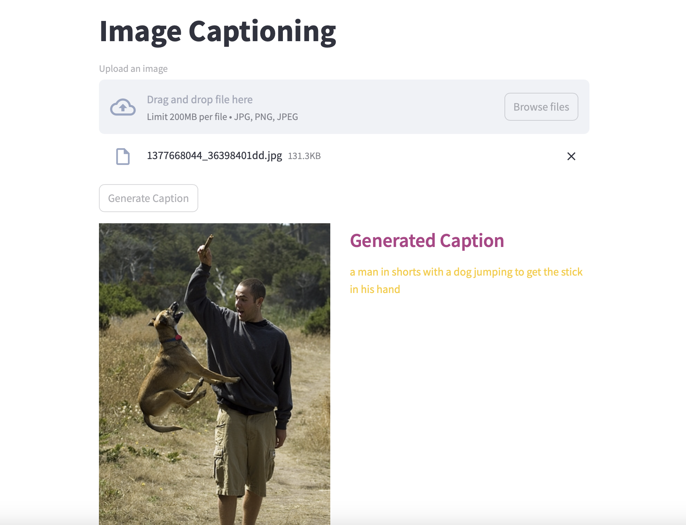

# Image Caption Generation


# Overview

This repo implements Image Caption Generation using ConvNxt + Transformer decoder architecture.
Go to notebook for dataset details and training code.

```
Pothole-detection/
├── notebook/              # Jupyter notebook contains implementation details.
├── weights/               # Contains best pt weights after training
├── config.yml             # Contains hyperparameters
├── app.py                 # Main script for running the application
├── model.py               # Defined model architecture used in training
├── prediction.py          # Load best weights in model for prediction
├── transformations.py     # apply same transformations on test image that were used in training images
└── requirements.txt       # required packages
```

## Usage
1. Clone repo
```
git clone https://github.com/amaanrzv39/Caption-Generation.git
cd Caption-Generation
```
2. Setup virtual env
```
python -m venv venv
source venv/bin/activate  # On Windows use `venv\Scripts\activate`
```
3. Install required packages
```
pip install -r requirements.txt
```
4. Run
```
streamlit run app.py --server.port=8000 
```

Contributions are welcome! Feel free to open issues or submit pull requests.

📜 License

This project is licensed under the MIT License.

